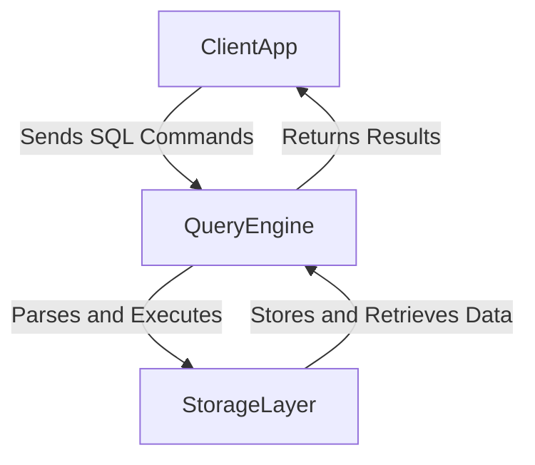

# SZBD Project

## Overview
The SZBD project is a simple SQL-like database engine implemented in C#. It includes a storage layer, a query engine, and a client application to interact with the database. The project supports basic SQL operations such as `SELECT`, `INSERT`, `UPDATE`, `DELETE`, `CREATE TABLE`, and `DROP TABLE`.

## Project Structure
- **ClientApp**: Contains the client application to interact with the database.
- **QueryEngine**: Implements the SQL-like query engine.
- **StorageLayer**: Manages data storage and indexing using B-Trees.
- **SZBD.Tests**: Contains unit tests for the project.

## Data Flow Diagram
Below is a diagram illustrating the data flow and interactions between the different layers of the SZBD project:



## Installation
- Download the ClientAppv1.0.0.rar file from releases.
- Extract the contents of the .rar file using software like WinRAR or 7-Zip.
- Run ClientApp.exe to start the application.

### Prerequisites
- .NET 8.0 SDK
- Visual Studio or any C# compatible IDE

### Building the Project
1. Clone the repository:
    ```sh
    git clone <repository-url>
    cd SZBD
    ```
2. Build the solution:
    ```sh
    dotnet build
    ```

### Running the Client Application
1. Navigate to the `ClientApp` directory:
    ```sh
    cd ClientApp
    ```
2. Run the application:
    ```sh
    dotnet run
    ```

### Running Tests
1. Navigate to the `SZBD.Tests` directory:
    ```sh
    cd SZBD.Tests
    ```
2. Run the tests:
    ```sh
    dotnet test
    ```

## Usage
On the first use, the application will ask for a directory that will be used as a storage for JSON files, you need to specify a folder like: C:\databasefolder
Once the storage directory is specified and client application is running, you can interact with the database using SQL-like commands. Here are some examples:

- **Create a table**:
    ```sql
    CREATETABLE Users (Id INT PRIMARY KEY, Name STRING, Age INT);
    ```

- **Insert a row**:
    ```sql
    INSERTINTO Users (Id, Name, Age) VALUES (1, 'John Doe', 30);
    ```

- **Select all rows**:
    ```sql
    SELECT * FROM Users;
    ```

- **Update a row**:
    ```sql
    UPDATE Users SET Age = 31 WHERE Id = 1;
    ```

- **Delete a row**:
    ```sql
    DELETE FROM Users WHERE Id = 1;
    ```

- **Drop a table**:
    ```sql
    DROPTABLE Users;
    ```

## Acknowledgements
- [Irony](https://github.com/IronyProject/Irony) for the parsing library.
- [Serilog](https://serilog.net/) for logging.
